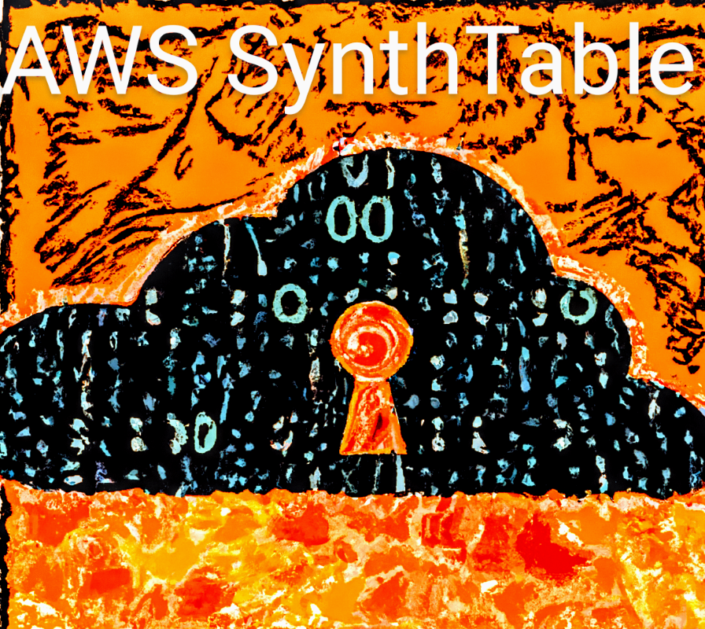

# SynthTable
is a guided CLI wizard that generates synthetic tabular data without requiring any ML knowledge or coding. Built using open-source package [SDV](https://github.com/sdv-dev/SDV), it creates high-quality, realistic data sets for testing, development, and research. The user-friendly interface with guided prompts makes it easy for users to generate the exact data they need, all while ensuring privacy and security.

## Quick Start

1. Download binary 
2. Upload it to AWS CloudShell
3. Run the following command: `./synth_table`
5. Follow the prompts to create your synthetic data

## Installation

1. Clone the repository
2. Compile the code by running `cargo run` (this may take some time).
3. Follow the prompts to generate your synthetic data.

## Requirements

1. Your source table should be stored in an S3 bucket and cataloged using [AWS Glue](https://docs.aws.amazon.com/glue/latest/dg/catalog-and-crawler.html).
2. The region where your data is located must have at least one VPC with at least one private subnet.
3. The user running the script should be granted temporary [AdminitratorAcces permission set](https://docs.aws.amazon.com/singlesignon/latest/userguide/get-started-create-an-administrative-permission-set.html) to streamline the process.

## Process for Generating Synthetic Data for a Single Table
1. Choose the AWS Glue database where your table is located.
2. Choose the table for which you want to generate synthetic data. Only tables on S3 will appear in the list.
3. Select an Amazon VPC in the same AWS Region as the table data that has at least one [private subnet](https://docs.aws.amazon.com/vpc/latest/userguide/VPC_Scenario2.html).
4. The process will select a subnet and launch an EC2 instance with minimum required privileges to generate the data.
5. You will be updated on the progress throughout the process.
6. Once the data is generated, it will be cataloged in the AWS Glue catalog in the same database and with the same prefix as the source data, but with the "_synthetic" prefix.
7. You can use AWS Athena to view the data.
8. The instance will be terminated after the process is completed and log data will be available in AWS CloudWatch logs under log-group - SynthTable log-stream - table_name. The model used to generate the synthetic tabular data will be destroyed at the time of instance termination.

## Security

See [CONTRIBUTING](CONTRIBUTING.md#security-issue-notifications) for more information.

## License

This project is licensed under the Apache-2.0 License.

SDV is licensed under Business Source License 1.1.